# REloaded

Available at: [TryHackMe](https://tryhackme.com/room/reloaded)
</br>Made by: [Whiteheart](https://tryhackme.com/p/Whiteheart)

## Level 0

The hint might lead you to think that simply running `strings` (Windows has no proper equivalent) will do the trick, but this is not the case. So I started up ghidra and told it to begin analysis.</br>
Then I ran the executable (it is a Windows executable):
```
PS D:\CTF\TryHackMe\REloaded> .\Level-0.exe
Enter The Flag :: dw
Dont Worry its a start ;)
```
Right, this might seem useless, but all it took from here was to search for the two strings `Enter The Flag` and `Dont Worry its a start ;)`. In ghidra you can do this by pressing `Ctr+Shift+E`.</br>
The search results:</br>
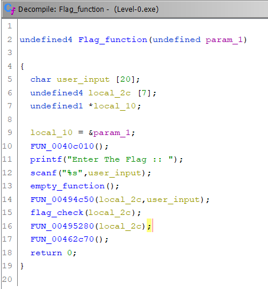</br>
Nice, here I added a few function names. As we can see it takes our user input, runs a few functions and checks if we entered the flag. </br>
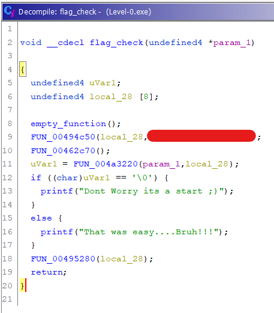</br>
And here is the `flag_check` function. Obviously that is me renaming it, but again it takes the input we gave, inputs that along with the hardcoded flag into a checker function and then based on return value prints a response. That is all we need! Onto level 1

## Level 1

Loaded into ghidra and set to analyze. When we run the binary we get the following:
```
PS D:\CTF\TryHackMe\REloaded> .\Level-1.exe
N00b a day, pro for life
```
Cool, we can start by searching for that. Since this time it doesn't take our user input. `Ctrl+Shift+E` and search for `N00b a day, pro for life`.</br>
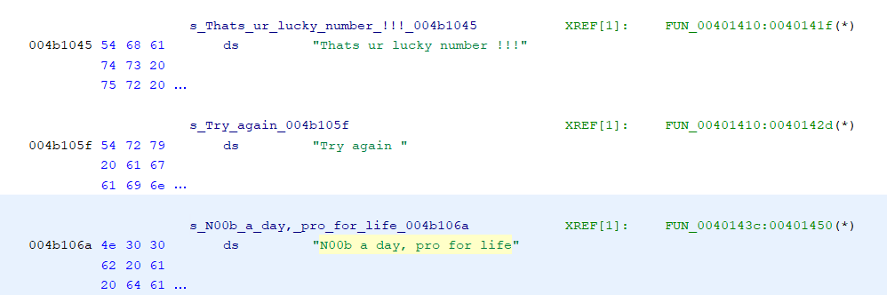</br>
And we can see multiple strings, very nice! </br>
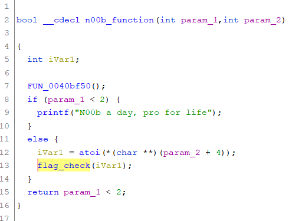</br>
Here we can see the function that gives us the `N00b by day,...` string. And in it (if a condition is not met) is a call to a function I named `flag_check`. Now look back at the location of the `N00b` string from before. It contains a `lucky number` string as well. And that is exactly what `flag_check` references.</br>
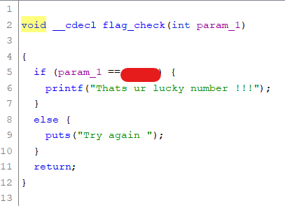</br>
Cool, there is a comparison of the input parameter, and if it is true we get the `Thats ur lucky number !!!` string! That is our flag for level 1. 

## Level 2

Again, I loaded the binary and while I waited for it to analyze I ran the binary. Obviously, if we were reverse engineering something malicious, you would want to run this in a contained environment like a VM or possibly docker.</br>
```
PS D:\CTF\TryHackMe\REloaded> .\Level-2.exe
Wow Ur At L3?
```
Okay, yet again no input. Time to search for the string and see what the app does. The task description might give us some hints of what to look for:
```
As a security analyst, you found some suspicious app in your organization which enables employees secretly share their file to the rival organization.  Your task is to find who is involved in this treachery, but the app needs some key to log in. Can you patch this app to bypass Authentication?
```
Nice, we found it:</br>
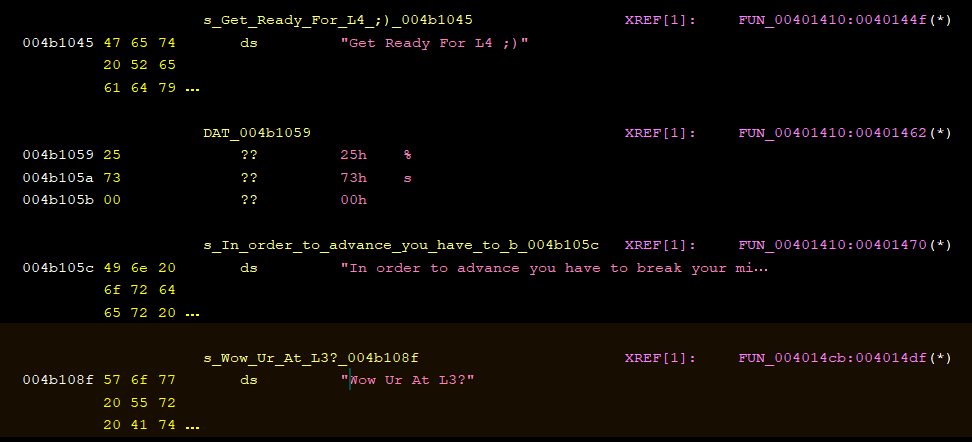</br>
*Yes, I switched to dark mode.* And so what about the other two strings?</br>
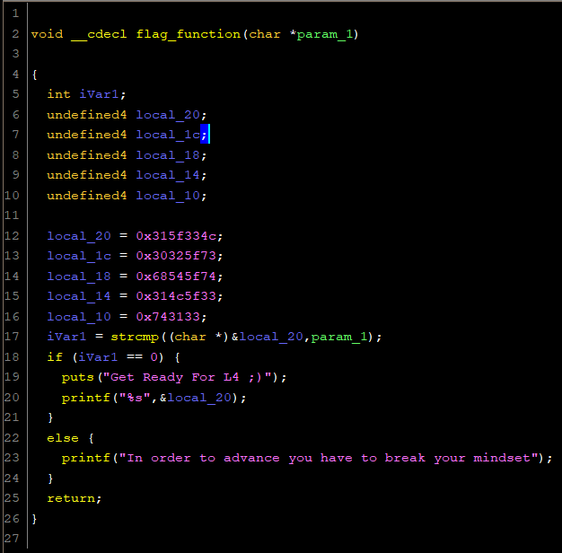</br>
Right, so we can see that in order to get the flag in `printf("%s",&local_20);` the input must be be equal to he local variable 20. How can we do this?
```
PS D:\CTF\TryHackMe\REloaded> .\Level-2.exe a
In order to advance you have to break your mindset
```
So yes, I was wrong about not having input. We have to think differently. *Note: This might mean that `param1` in wow_function is actually `argc` meaning the number of arguments provided*</br>
So the trick is to modify a comparison instruction such as `JNZ,JZ,JNE` etc. We want it to jump to the `puts` of our flag. Then just `File -> Export Program ...` and export it as a binary. 

**Note: Ghidra adds a .bin extension to the binary file, you will have to remove it to run. (For Windows, not tested on Linux)**

## Level 3

```
PS D:\CTF\TryHackMe\REloaded> .\Level-3.exe
Enter the flag ::awdaiwd
-_-
```
So searching for `-_-` does nothing, but searching for `Enter the flag` I found the following:</br>

</br>
SO we have the enter string and a `Rooted !!!` string. Time to check out the corresponding functions.
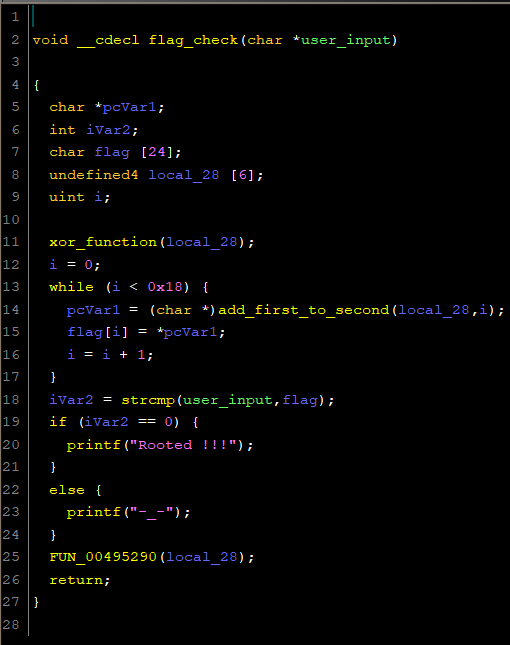</br>
Here is the renamed function along with renamed variables and an extra function. As we can see it calls XOR on the password:
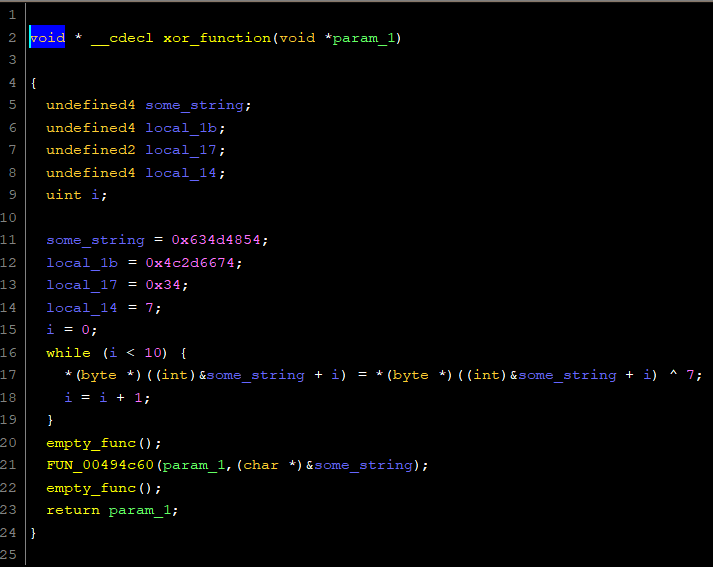</br>
This time we will have to check the memory of the binary, and we can only do that while it is running. Time for debugging.</br>
I couldnt get immunity debugger to run and IDA doesnt sit well with me, so I had to opt for the old OllyDBG. It is pretty ugly (sorry Olly)</br>
From the flag function we know that the flag is set before a call to the `xor_func`. So I set a breakpoint at `xor_func` and examined the variables and memory:</br>
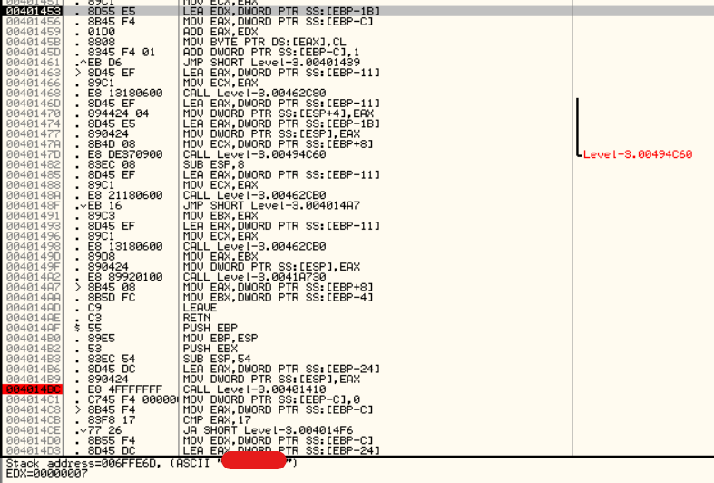

## Level 4
When we run the binary we receive the following output. Interesting. Some sort of encryption?
```
PS D:\CTF\TryHackMe\REloaded> .\Level-4.exe
Amcm↨QBu^YP+`lD↨V1pvY^BdR
```
We can't search for this. But we can search for the function that printed this, either `printf` or `puts`. `Ctrl + Shift + E` in Ghidra and search for printf:</br>
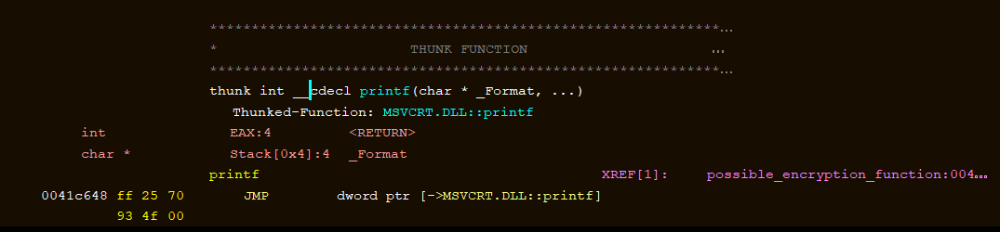</br>
So we can see the reference, as always I changed variable and function names to make it more readable:</br>
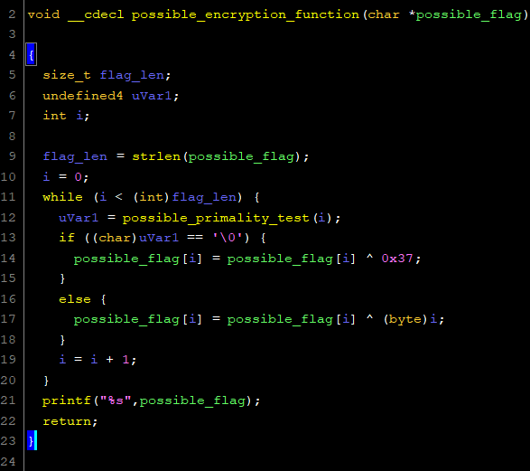</br>
Cool, and this is referenced in the following function:</br>
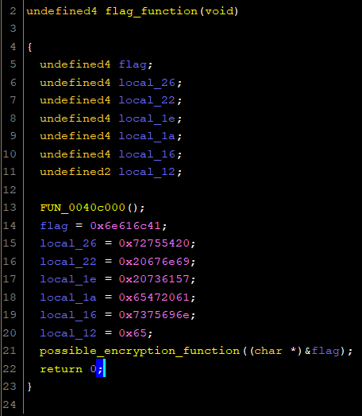</br>
And we can see the flag variable, this can easily be broken at runtime, as the flag is loaded in unencrypted:</br>
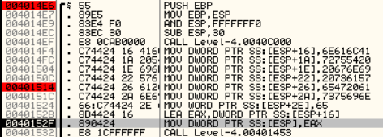</br>
How did I know where to set the breakpoints? Well the first instruction is the start of our `flag` function, from there I was just stepping and then added a breakpoint by accident (:P). From there I stepped all the way to `MOV DWORD PTR SS:[ESP],EAX` which is the last instruction before the `encryption` call. Then just check the stack:</br>
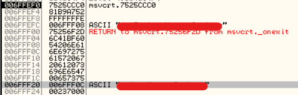</br>
And there we have it.  
